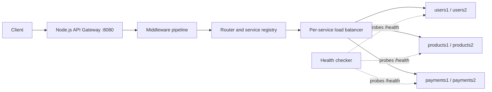
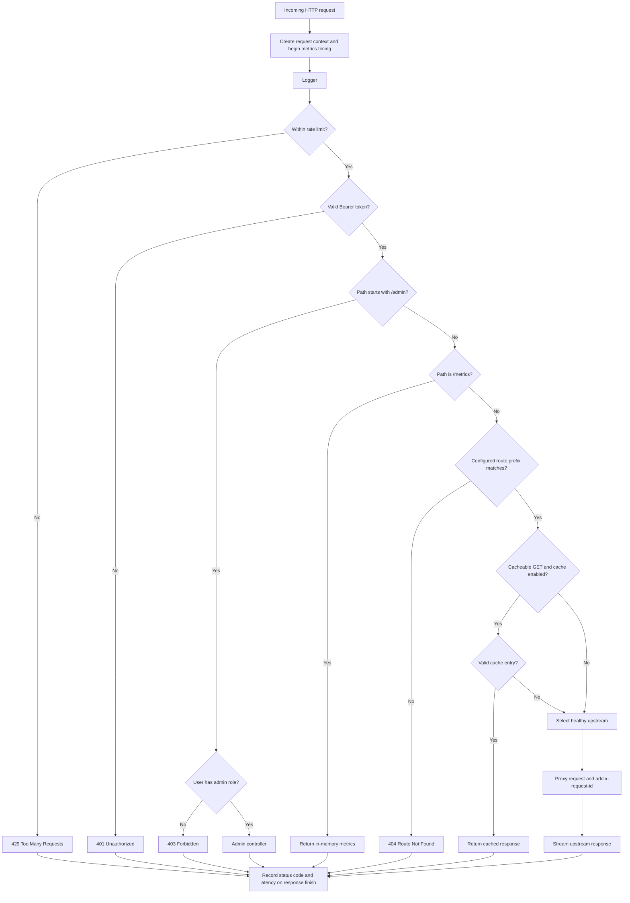

# API Gateway

A production-inspired API Gateway built from scratch with Node.js core modules. The project deliberately avoids Express so that the HTTP server, middleware composition, routing, reverse proxying, load balancing, health checking, and request lifecycle remain visible in the implementation.

The gateway accepts client traffic on one public endpoint, authenticates and rate-limits it, resolves the configured service, optionally serves a cached response, and proxies the request to a healthy backend instance. It is intended as an educational infrastructure project with a Docker-based multi-service deployment.

## Features

- [x] Reverse proxy built with `node:http`
- [x] YAML-driven service and route configuration
- [x] Per-service upstream server pools
- [x] Startup validation of routes, services, strategies, caches, and instances
- [x] Round-robin, random, and least-connections load balancing
- [x] Periodic upstream health checks
- [x] Retry-based failover across eligible upstream instances
- [x] In-memory, TTL-based GET response cache
- [x] Bearer-token authentication and admin-role authorization
- [x] In-memory fixed-window rate limiting by client IP address
- [x] Request, latency, status-code, service, and cache metrics
- [x] Protected administrative endpoints
- [x] Docker Compose deployment with six backend containers
- [x] Unit tests, integration tests, and benchmark scripts

## Architecture



Configuration is loaded at startup from [`src/config/gateway.yaml`](src/config/gateway.yaml). It defines route prefixes and maps each service to its instances, load-balancing strategy, and cache policy. The gateway constructs a service registry and server pool from that configuration before it begins accepting requests.

## Request lifecycle

The application composes middleware in registration order. A middleware may end the response early; otherwise it delegates to the next stage.



The request context contains the Node request and response objects, a UUID request ID, the resolved service and route, and shared middleware state. The proxy forwards the original method, URL, headers, and body, while adding `x-request-id` for upstream correlation.

## Project structure

```text
src/
  admin/          Protected runtime inspection and cache-management handlers
  auth/           Built-in token authenticator
  backend/        Small containerized backend used by Compose and integration flows
  cache/          In-memory cache and cache middleware
  config/         Environment loading, YAML configuration, and validation
  core/           Application middleware composer and request context
  metrics/        Process-local metrics collector
  middleware/     Logging, authentication, rate limit, admin, routing, and proxy stages
  rateLimiter/    Fixed-window per-client limiter
  router/         Configured prefix router
  server/         Gateway startup entry point
  services/       Service registry and service model
  upstream/       Server pool, health checker, proxy, and load-balancing strategies

tests/
  unit/           Isolated tests for domain components
  integration/    Requests against a running gateway deployment

docker/            Gateway/backend Dockerfiles and Compose definition
benchmarks/        Benchmark scripts and recorded benchmark reports
docs/              Additional design and test documentation
```

For a topic-by-topic guide to the implementation, see the [documentation index](docs/00-documentation-guide.md).

## Configuration

### Environment

The gateway loads environment variables through `dotenv`; all of the following are required at startup:

| Variable | Purpose | Validation |
|---|---|---|
| `PORT` | Gateway listener port | Number from 1 to 65535 |
| `UPSTREAM_TIMEOUT` | Per-attempt upstream request timeout | Positive number |
| `HEALTH_INTERVAL` | Interval between upstream health-check rounds | At least 1000 ms |
| `HEALTH_TIMEOUT` | Timeout for each health probe | At least 500 ms |
| `RATE_LIMIT` | Requests permitted per client window | Positive number |
| `RATE_WINDOW_MS` | Fixed-window duration | Positive number |

The repository contains a local `.env` file used by Docker Compose. It is intentionally not reproduced here; create an equivalent file with values appropriate for the environment before starting the gateway outside an existing setup.

### Gateway YAML

[`src/config/gateway.yaml`](src/config/gateway.yaml) is parsed and validated when the process starts. Each route has a path prefix and a target service. Each service specifies a strategy, cache settings, and one or more `{ host, port }` instances.

```yaml
routes:
  - path: /users
    service: users

services:
  users:
    strategy: leastConnections
    cache:
      enabled: false
      ttl: 10
    instances:
      - host: users1
        port: 8001
```

The validator rejects missing route arrays, missing paths or service names, routes referencing unknown services, duplicate route paths, invalid strategies, missing or invalid cache configuration, empty instance lists, missing host or port values, and duplicate instances within a service.

### Current service configuration

| Service | Route prefix | Strategy | Cache |
|---|---|---|---|
| `users` | `/users` | `leastConnections` | Disabled (TTL configured as 10 s) |
| `products` | `/products` | `random` | Disabled (TTL configured as 10 s) |
| `payments` | `/payments` | `leastConnections` | Enabled, 60 s TTL |

Routing performs first-match prefix matching. For example, a `/users/profile` request resolves to `users` when `/users` is configured. Route declaration order therefore matters if prefixes overlap.

## Core components

### Reverse proxy and failover

For a routed request, the proxy reads the incoming body, asks the load balancer for an eligible server, and sends an equivalent `http.request` to that instance. Upstream status and headers are copied to the client response, and the upstream response stream is piped directly to the client.

Each attempt is tracked in an exclusion set. Connection errors mark that upstream unhealthy and cause the proxy to try another eligible instance. An upstream timeout is represented as a `504` error and also permits another eligible instance to be attempted. If no healthy server is initially available, the gateway returns `503 Service Unavailable`; if all attempted instances fail, it returns either `502 Bad Gateway` or `504 Gateway Timeout` based on the last failure.

### Load balancing

Every service receives its own strategy instance:

| Strategy | Selection behavior |
|---|---|
| `roundRobin` | Walks the service's server list in cyclic order, skipping unhealthy or excluded servers. |
| `random` | Randomly selects from healthy, non-excluded servers. |
| `leastConnections` | Selects the healthy, non-excluded server with the lowest active-proxy connection count. |

Active connection counts increment before an upstream request and decrement when the client response finishes or an attempt errors. They are local process state and are not shared across gateway replicas.

### Health checks

A background health checker periodically issues `GET /health` to every configured upstream. A `200` response marks an instance healthy; another status, a timeout, or a request error marks it unhealthy. Load-balancing strategies ignore unhealthy instances, so a recovered instance re-enters selection after a later successful probe.

### Cache

The cache middleware runs after a service has been resolved. It considers only GET requests for services with `cache.enabled: true` and skips WebSocket upgrade requests. Keys use the exact method and URL, such as `GET:/payments?currency=INR`.

On a miss, the middleware captures a successful (`200`) response body and headers and stores them in process memory until the service TTL expires. On a hit, it returns the saved response without contacting an upstream. Expired entries are deleted when read. Cache entries are not bounded by size, shared between processes, or invalidated by upstream writes; administrators can clear the entire cache.

### Authentication and rate limiting

Authentication expects `Authorization: Bearer <token>`. The current authenticator is a demonstration in-memory map containing `user-token` (role `user`) and `admin-token` (role `admin`); it is not an external identity provider or signed-token verifier.

Rate limiting occurs before authentication. It uses `req.socket.remoteAddress` as the client identity and counts requests in a fixed in-memory window. This means unauthenticated requests are also counted, limiter state resets on process restart, and deployments behind a proxy need appropriate address-handling design before using this as a production control.

### Metrics and logging

The application records each request at entry and, when the response finishes, records its final status code and elapsed latency. It also records resolved service requests and cache hits, misses, and stores. The logger emits one line per completed request with timestamp, level, request ID, method, URL, selected upstream when present, status, and duration.

All metrics are in memory and reset when the gateway restarts.

## HTTP endpoints

All endpoints pass through rate limiting and bearer-token authentication.

| Endpoint | Method | Access | Behavior |
|---|---|---|---|
| Configured service prefixes | Any | Any authenticated user | Routes and proxies to the configured service. |
| `/metrics` | Any | Any authenticated user | Returns JSON metrics; the implementation does not restrict the HTTP method. |
| `/admin/routes` | GET | Admin | Returns the active route snapshot. |
| `/admin/services` | GET | Admin | Returns service strategy and runtime upstream snapshots. |
| `/admin/config` | GET | Admin | Returns server, proxy, health, and rate-limit configuration. |
| `/admin/cache` | GET | Admin | Returns the current cache entry count. |
| `/admin/cache` | DELETE | Admin | Clears all in-memory cache entries. |

Example requests:

```bash
curl -H "Authorization: Bearer user-token" http://localhost:8080/users
curl -H "Authorization: Bearer user-token" http://localhost:8080/metrics
curl -H "Authorization: Bearer admin-token" http://localhost:8080/admin/services
curl -X DELETE -H "Authorization: Bearer admin-token" http://localhost:8080/admin/cache
```

## Running

### Prerequisites

- Node.js 22 or a compatible modern Node.js runtime
- npm
- Docker and Docker Compose for the containerized stack

### Install dependencies

```bash
npm install
```

Ensure the required environment variables are available through `.env` or the process environment, then start the gateway:

```bash
npm start
```

For file-watching development mode:

```bash
npm run dev
```

### Run the Docker stack

From the repository root, use the nested Compose file:

```bash
docker compose -f docker/docker-compose.yml up --build
```

This creates the `gateway` container on port `8080` and two backend containers for each configured service. The Compose definition mounts `src/config/gateway.yaml` into the gateway container as read-only and reads its environment from the root `.env` file.

## Testing

The project uses Node's built-in test runner.

```bash
npm test
npm run test:integration
npm run test:all
```

Unit tests exercise the router, service registry, server pool, server model, load balancer, balancing algorithms, cache, metrics collector, authenticator, and rate limiter in isolation.

Integration tests send HTTP requests to `localhost:8080`; they expect a running gateway and reachable backend services. They cover successful routing, authentication, administrator authorization, rate-limit responses, metrics, caching behavior, and a basic healthy-instance failover scenario. See [`docs/testing/failover.md`](docs/testing/failover.md) for manual failover scenarios.

## Benchmarks

The benchmark scripts use `autocannon` and target the live gateway. Available scripts are:

```bash
npm run benchmark:users
npm run benchmark:products
npm run benchmark:payments
```

Recorded benchmark reports are intentionally maintained separately and are not duplicated here:

- [`benchmarks/01-baseline.md`](benchmarks/01-baseline.md)
- [`benchmarks/02-cache.md`](benchmarks/02-cache.md)
- [`benchmarks/03-load-balancer.md`](benchmarks/03-load-balancer.md)
- [`benchmarks/04-failover.md`](benchmarks/04-failover.md)

Some reports describe temporary configuration changes—for example, enabling cache for `users` or selecting round robin—to isolate a behavior under test. Treat [`src/config/gateway.yaml`](src/config/gateway.yaml) as the source of truth for the current runtime configuration.

## Current limitations and future improvements

The project intentionally keeps several concerns in process to expose the gateway mechanics clearly. Current limitations include hard-coded tokens, no graceful shutdown, process-local state, no connection pooling, no request-size limits, and no cache invalidation beyond TTL or the administrator clear operation.

Reasonable next steps include:

- JWT or external identity-provider integration
- Shared rate-limit and cache stores
- Configurable route priority or longest-prefix matching
- Circuit breakers, retry policies, and backoff
- Service discovery and dynamic configuration reloads
- Prometheus-compatible metrics and structured log output
- Distributed tracing and request-size controls
- Graceful shutdown and upstream connection lifecycle management

## License

This project is licensed under the [MIT License](LICENSE).
