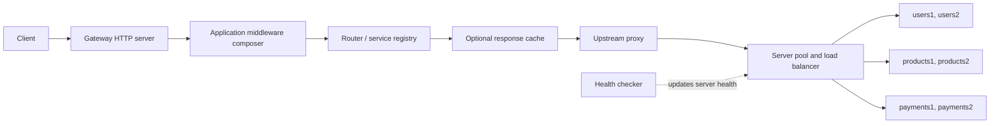

# Architecture

## Purpose

This project implements an API gateway with Node.js core modules rather than a framework. Its architecture makes the request path explicit: a small application object composes middleware, configuration defines the available services, and the upstream layer selects and contacts a backend instance.

The gateway is a single Node.js process. Its cache, rate-limit counters, metrics, server health state, and active connection counts all reside in that process.

## Runtime topology



Docker Compose builds one gateway container and six backend containers. The backend program is intentionally simple: it returns JSON identifying the service and instance that handled a request. This makes routing and load-balancer behavior observable during development and benchmarks.

## Startup sequence

1. `src/config/env.js` loads and validates required environment variables through `dotenv`.
2. `src/config/gateway.js` reads `gateway.yaml`, parses it with `yaml`, and validates its structure.
3. `src/config/config.js` merges environment and gateway configuration into the exported configuration object.
4. Module initialization creates the router, service registry, server pool, and per-service load-balancing strategies from that configuration.
5. Importing `src/upstream/proxy.js` starts the periodic health checker.
6. `src/server/server.js` registers middleware and starts the Node `http` server.

Configuration is therefore loaded once at process startup. Although some classes can replace their internal state, the running gateway does not expose a configuration reload operation.

## Request execution model

`Application` stores middleware functions and composes them with a Koa-style `next` callback. It prevents a middleware from invoking `next()` more than once in the same chain. `Context` is created for every request and carries the raw request/response objects, a generated UUID request ID, resolved route and service fields, and a `state` object for middleware sharing.

```mermaid
sequenceDiagram
    participant C as Client
    participant A as Application
    participant M as Middleware
    participant P as Proxy
    participant U as Upstream

    C->>A: HTTP request
    A->>A: Create Context; record request
    A->>M: Dispatch middleware chain
    M->>P: Continue after validation/routing
    P->>U: Forward request with x-request-id
    U-->>P: Upstream response stream
    P-->>C: Pipe status, headers, and body
    A->>A: On response finish, record status and latency
```

The registered order is logger, rate limiter, authentication, administrator handler, router, cache, and proxy. Because each early response terminates the chain, an unauthenticated or rate-limited request never reaches routing or an upstream.

## Key modules

| Area | Main modules | Responsibility |
|---|---|---|
| Core | `core/application.js`, `core/context.js` | Compose middleware and hold request-scoped state. |
| Configuration | `config/*.js`, `config/gateway.yaml` | Load and validate deployment and routing settings. |
| Middleware | `middleware/*.js` | Apply cross-cutting policy and dispatch requests. |
| Services and routes | `services/*.js`, `router/*.js` | Map a URL prefix to a configured service. |
| Upstream | `upstream/*.js` | Track instances, select one, proxy requests, and probe health. |
| Operations | `cache/*.js`, `metrics/*.js`, `admin/*.js` | Provide process-local runtime controls and observability. |

## Design choices

- **Core HTTP APIs:** `http.createServer` and `http.request` keep transport handling visible and avoid framework abstractions.
- **Configuration-driven services:** route and instance changes are data changes in YAML rather than changes to middleware code.
- **Streaming response forwarding:** the proxy pipes upstream responses instead of buffering the full response before returning it, except when cache middleware intentionally captures a cacheable response.
- **Shared request context:** middleware avoids mutating global request-specific state and can add values such as `ctx.user`, `ctx.service`, and `ctx.upstream`.

## Current limitations

- Startup configuration is static; no reload or service discovery is implemented.
- State is neither persistent nor shared between gateway processes.
- The process has no graceful-shutdown workflow.
- The standalone `src/server/handler.js` is not wired into `src/server/server.js`; it should not be treated as an active gateway endpoint implementation.
- Backend health probes receive a `200` from the demo backend's generic response handler rather than a dedicated health endpoint.

For endpoint, configuration, and execution details, see the repository [README](../README.md).
