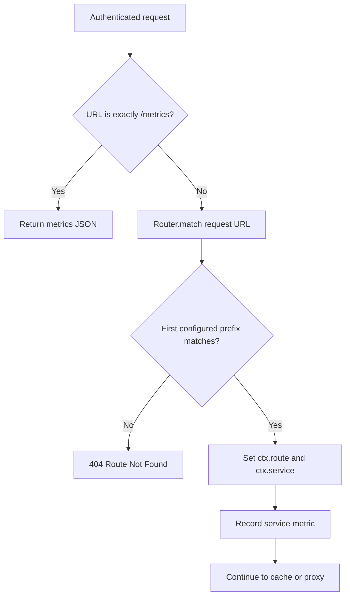

# Routing

## Purpose

Routing maps an incoming URL to a configured service name. The router does not perform upstream selection itself; it identifies the service that the service registry and upstream layers should use next.

## Configuration model

Routes live in `src/config/gateway.yaml`:

```yaml
routes:
  - path: /users
    service: users
```

At startup, `Router.loadRoutes()` converts each entry to a `Route` instance. `ServiceRegistry` separately registers a `Service` for every item under `services` in the same configuration file. Validation guarantees that each route references a declared service and that route paths are not duplicated.

## Request flow



`routerMiddleware` owns the gateway's special `/metrics` response. It runs after authentication, so metrics require a valid bearer token but do not require the administrator role. All other URLs are passed to `Router.match()`.

## Matching semantics

`Router.match(path)` iterates routes in declaration order and returns the service for the first route whose configured prefix satisfies `path.startsWith(prefix)`.

| Request URL | Configured prefix | Result |
|---|---|---|
| `/users` | `/users` | Matches `users`. |
| `/users/profile` | `/users` | Matches `users`. |
| `/unknown` | `/users`, `/products`, `/payments` | No match; returns 404. |

This is prefix routing, not exact-path routing. It does not strip the prefix before proxying: the upstream receives the original `ctx.req.url` unchanged.

> Route order is significant when prefixes overlap. The implementation does not sort routes by longest prefix or report overlapping prefixes as invalid.

## Important classes and modules

| Module | Role |
|---|---|
| `router/route.js` | Small model containing a prefix and service name. |
| `router/router.js` | Registers routes, replaces them from configuration, returns snapshots, and performs prefix matching. |
| `router/routes.js` | Creates the process-wide router and loads config at import time. |
| `services/service.js` | Holds a service name plus strategy, cache policy, and configured instances. |
| `services/serviceRegistry.js` | Stores and retrieves services by name. |
| `middleware/router.js` | Connects the request context to the router and registry. |

## Administrative visibility

`GET /admin/routes` returns `router.getSnapshot()`, which exposes the active path/service pairs. This route is handled by administrator middleware before regular routing and requires both authentication and the `admin` role.

## Design decisions

- **Routes and services are separate:** a route answers which service owns a path; the service carries policy and instances.
- **Prefix matching supports service subpaths:** a single `/users` route naturally forwards `/users/profile` without additional entries.
- **Validation is early:** invalid references stop the process during startup instead of producing a runtime misroute.

## Current limitations

- Query strings remain part of the string passed to `match`; routing has no parsed URL abstraction.
- There are no path parameters, methods per route, host-based rules, rewrites, or route priorities.
- A route can be loaded only at startup in the active application.
- `ctx.route` is assigned the service name rather than a `Route` object; consumers needing path metadata should use the router snapshot.
