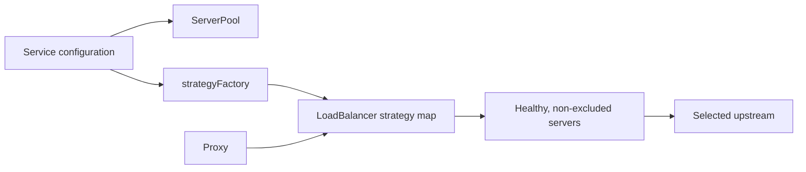
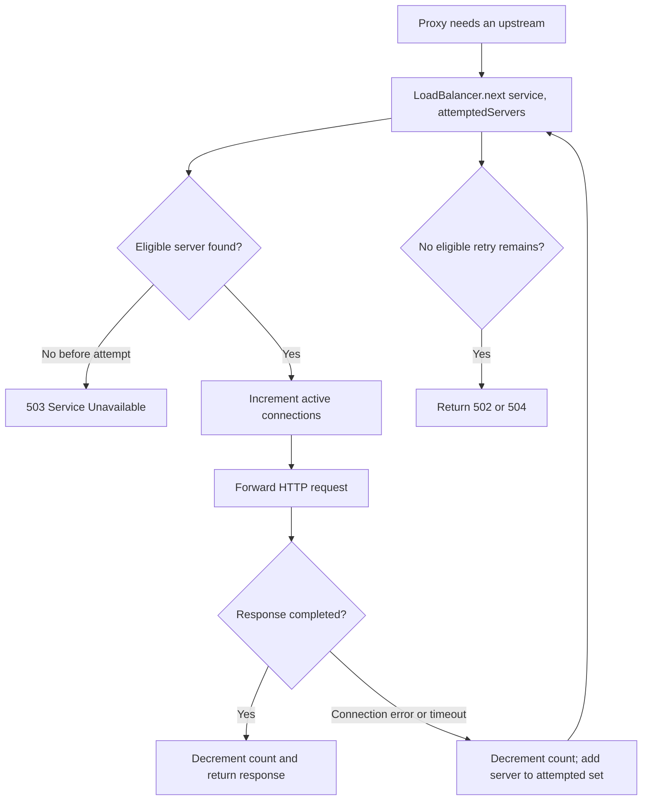

# Load Balancer

## Purpose

The load balancer selects one healthy upstream instance for a resolved service. It receives a service name from the proxy and delegates the choice to the strategy configured for that service.

## Server pool and strategy setup

`ServerPool.loadServices()` creates an `UpstreamServer` for every configured service instance. Each server records its service, host, port, health flag, and active connection count. `LoadBalancer.loadStrategies()` creates one strategy object per service using `strategyFactory`.

The strategy map is keyed by service name, allowing different services to use different algorithms. The currently configured services use `leastConnections` for `users` and `payments`, and `random` for `products`.

## Selection algorithms

| Strategy | Implementation | Behavior |
|---|---|---|
| `roundRobin` | `algorithms/roundRobin.js` | Advances a per-strategy index through the service server list. |
| `random` | `algorithms/random.js` | Chooses a random entry from the eligible server list. |
| `leastConnections` | `algorithms/leastConnections.js` | Iterates eligible servers and retains the one with the lowest active count. |

All algorithms receive an `excludedServers` set. They skip unhealthy entries and every server already attempted by the current proxy request. If no candidate remains, they return `null`.

## Request and failover flow

Connection errors mark the failed server unhealthy. A timeout creates an error with status `504`, but does not itself mark the server unhealthy. Either case can lead to a retry against another eligible server.

## Connection accounting

`attemptRequest()` increments the selected server before issuing the upstream request. On a successful upstream response, it decrements after the gateway response emits `finish`; on request error, it decrements before rejecting the attempt. Counts never become negative because `UpstreamServer.decrementConnections()` guards against it.

Least-connections selection uses this counter, not CPU use, latency, or backend-provided load. With equal counts, the first eligible server in pool order wins.

## Runtime inspection

`GET /admin/services` returns each service's configured strategy alongside server snapshots containing host, port, `healthy`, and `activeConnections`. The endpoint requires an administrator token.

## Design decisions

- **Strategy objects are isolated per service:** round-robin progress for one service does not affect another.
- **Health is checked inside strategies:** every strategy consistently ignores unavailable instances.
- **Request-local exclusions prevent retry loops:** a failed server cannot be selected twice for one client request.

## Current limitations

- No weights are used, despite `UpstreamServer` initializing a `weight` field for future use.
- Health and active-connection state are process-local.
- No session affinity, passive latency scoring, queueing, or outlier ejection is implemented.
- A client-disconnected response may not emit the successful finish path expected for connection accounting.

See [health checks](07-health-checks.md) for how `healthy` is maintained and [benchmark documentation](10-benchmarks.md) for the strategy test method.
