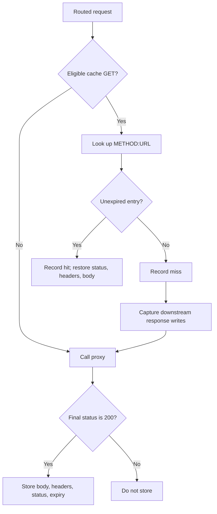

# Cache

## Purpose

The response cache avoids an upstream call for repeat GET requests to services that explicitly enable caching. It is a process-local `Map` of complete successful responses with per-entry expiry.

## Eligibility and keying

Cache middleware runs after routing, so it can inspect `ctx.service.cache`. A request bypasses caching when any of these conditions is true:

- the method is not `GET`;
- the resolved service has `cache.enabled: false`; or
- the request declares `Upgrade: websocket`.

The key is the exact string `${method}:${url}`. It includes query text because it uses `req.url`; it does not include host, authorization identity, request headers, or request body.

## Flow

On a miss, the middleware wraps `res.write` and `res.end` to collect outgoing response chunks. Once the proxy has completed, a `200` response is stored as a `CacheEntry`; other statuses are forwarded but not cached. On a hit, the cache middleware ends the response and does not call the proxy.

## Important classes

| Component | Responsibility |
|---|---|
| `CacheEntry` | Stores status code, headers, body buffer, and absolute expiry time. |
| `MemoryCache` | Provides get, set, delete, clear, has, and size operations over a `Map`. |
| `cache/index.js` | Exports the singleton cache for the running process. |
| `cache/cache.js` | Implements eligibility, response capture, hit delivery, and cache metrics. |

`MemoryCache.get()` lazily deletes an expired entry before returning `null`. There is no background expiry sweep.

## Cache policy

TTL is configured in seconds per service and converted to milliseconds when an entry is stored. In the checked-in YAML, only `payments` has cache enabled, with a 60-second TTL. `users` and `products` include TTL values but have caching disabled.

The cache stores the response headers returned by `res.getHeaders()`, including headers copied from an upstream. A hit restores each saved header and the saved status code before ending the response with the saved body buffer.

## Operations and metrics

Administrators can inspect the cache count with `GET /admin/cache` and remove all entries with `DELETE /admin/cache`. The metrics collector reports `cache.hits`, `cache.misses`, and `cache.stores` through authenticated `GET /metrics`.

## Design decisions

- **Cache after routing:** policies are service-specific instead of global.
- **Cache only successful GETs:** avoids treating non-idempotent methods or error responses as reusable entries.
- **Store complete responses:** status, headers, and body are replayed consistently on a hit.

## Current limitations

- The cache is unbounded and is lost on restart.
- It is not shared across gateway replicas.
- It has no invalidation by resource, tag, upstream event, or write request.
- Its key does not vary by authorization or content negotiation headers; caching user-specific responses would require a different policy.
- Concurrent misses for the same key are not coalesced, so multiple requests may call the upstream before the first response is stored.

Existing cache benchmark reports are preserved in [`../benchmarks/02-cache.md`](../benchmarks/02-cache.md); they may describe temporary configuration different from the checked-in YAML.
