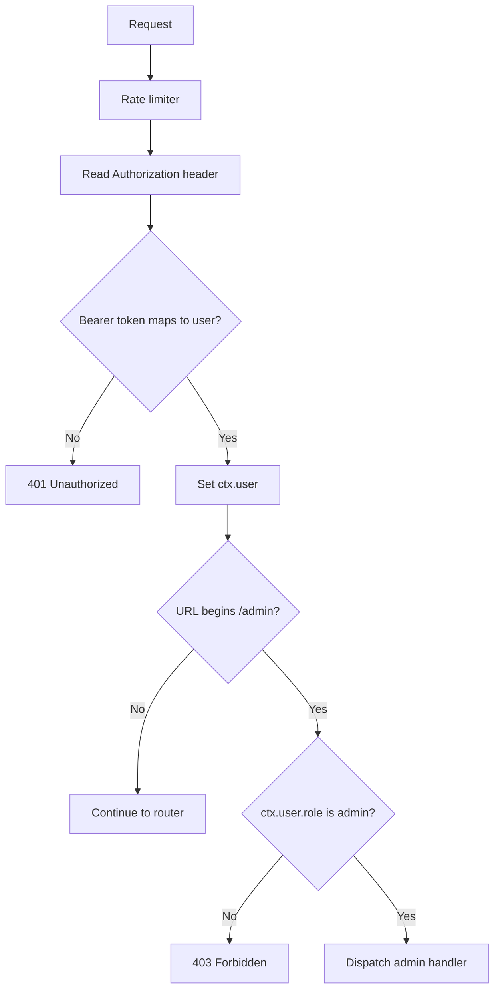

# Authentication and Administration

## Purpose

Authentication establishes a user object for every request that reaches routing or administration. The implementation is deliberately small: it demonstrates middleware-based bearer token handling and role-based protection for administrator endpoints.

## How authentication works

`middleware/auth.js` reads the `Authorization` header. It accepts only values beginning with `Bearer `, removes that prefix, and passes the remaining token to `Authenticator.authenticate()`.

`Authenticator` owns an in-memory `Map` with two fixed identities:

| Token | User | Role |
|---|---|---|
| `admin-token` | Admin | `admin` |
| `user-token` | User | `user` |

A known token returns `{ authenticated: true, user }`; missing, empty, or unknown tokens return `{ authenticated: false }`. Failed authentication ends the response with `401` and `{ "error": "Unauthorized" }`. Successful authentication sets `ctx.user` and continues the middleware chain.

## Request flow

Authentication runs before both the administrator and router middleware. Consequently, `/metrics` and service routes require a token even though they do not require an administrator role.

## Administrative endpoints

`middleware/admin.js` intercepts every path whose URL begins with `/admin`. It independently checks that `ctx.user` exists and then requires role `admin`. `admin/controller.js` routes the exact URL and method to these handlers:

| Endpoint | Method | Result |
|---|---|---|
| `/admin/routes` | GET | Active route snapshot. |
| `/admin/services` | GET | Configured strategy and live server-pool snapshots. |
| `/admin/config` | GET | Server, proxy, health, and rate-limit configuration. |
| `/admin/cache` | GET | Number of cache entries. |
| `/admin/cache` | DELETE | Clears the singleton in-memory cache. |

Unknown administrator paths return `404`; unsupported methods return `405`. Exact URL matching means query text changes the URL and will not match one of these handlers.

## Design decisions

- **Context-based identity:** downstream middleware receives a user object rather than repeating token parsing.
- **Role check in a dedicated middleware:** regular routing is not responsible for administrator authorization.
- **Small in-memory token map:** appropriate for demonstrating control flow without introducing a persistence or identity-provider dependency.

## Current limitations

- Tokens are hard-coded plaintext values in source code.
- There is no token expiry, signature verification, revocation, audience checking, or transport enforcement.
- Roles are a single string; no permission model exists.
- Authentication occurs after rate limiting, so invalid requests consume the same client quota.
- Administrator routing uses `startsWith('/admin')`, while its controller requires exact URL matches.

The implementation should be regarded as demonstration authentication, not a production identity boundary.
