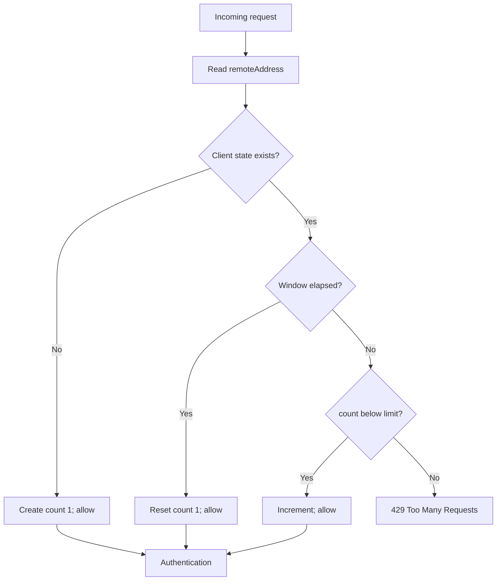

# Rate Limiter

## Purpose

The rate limiter bounds the number of requests accepted from a client during a fixed time window. It protects every request path because it is registered before authentication, administration, routing, caching, and proxying.

## How it works

`RateLimiter` stores a `Map` keyed by client identifier. Each value contains:

| Field | Meaning |
|---|---|
| `count` | Requests accepted in the active window. |
| `windowStart` | Millisecond timestamp at which the active window began. |

For each call to `allow(clientId)`:

1. A new client receives a count of one and is allowed.
2. If the current window has elapsed, the entry resets to one and is allowed.
3. If the count remains below the configured limit, it increments and is allowed.
4. Otherwise the request is denied.

`rateLimiterMiddleware` uses `ctx.req.socket.remoteAddress` as the identifier. A denial produces `429` with `{ "error": "Too Many Requests" }` and ends the pipeline.

## Request flow

## Configuration

Two required environment variables configure the singleton limiter when `middleware/rateLimiter.js` is imported:

| Variable | Meaning | Validation |
|---|---|---|
| `RATE_LIMIT` | Maximum allowed requests per client window | Positive number |
| `RATE_WINDOW_MS` | Window length in milliseconds | Positive number |

Changing an environment variable requires a process restart; there is no runtime administration endpoint for the limiter.

## Design decisions

- **Fixed window:** a small state model is easy to inspect and unit test.
- **IP-address key:** requires no authentication state and makes the limit applicable to unauthenticated traffic.
- **Early middleware placement:** rejected traffic does not consume router, cache, or upstream resources.

## Current limitations

- Fixed windows can allow bursts around a window boundary.
- The map is unbounded and has no cleanup for inactive clients.
- State is local to one gateway process and resets on restart.
- `remoteAddress` may represent a reverse proxy rather than an end user in a deployed topology; trusted-forwarded-header handling is not implemented.
- Responses do not include standard rate-limit or retry headers.

Unit tests cover first use, limit exhaustion, independent clients, and window reset. Integration tests exercise the HTTP `429` behavior against a running gateway; see [testing](09-testing.md).
