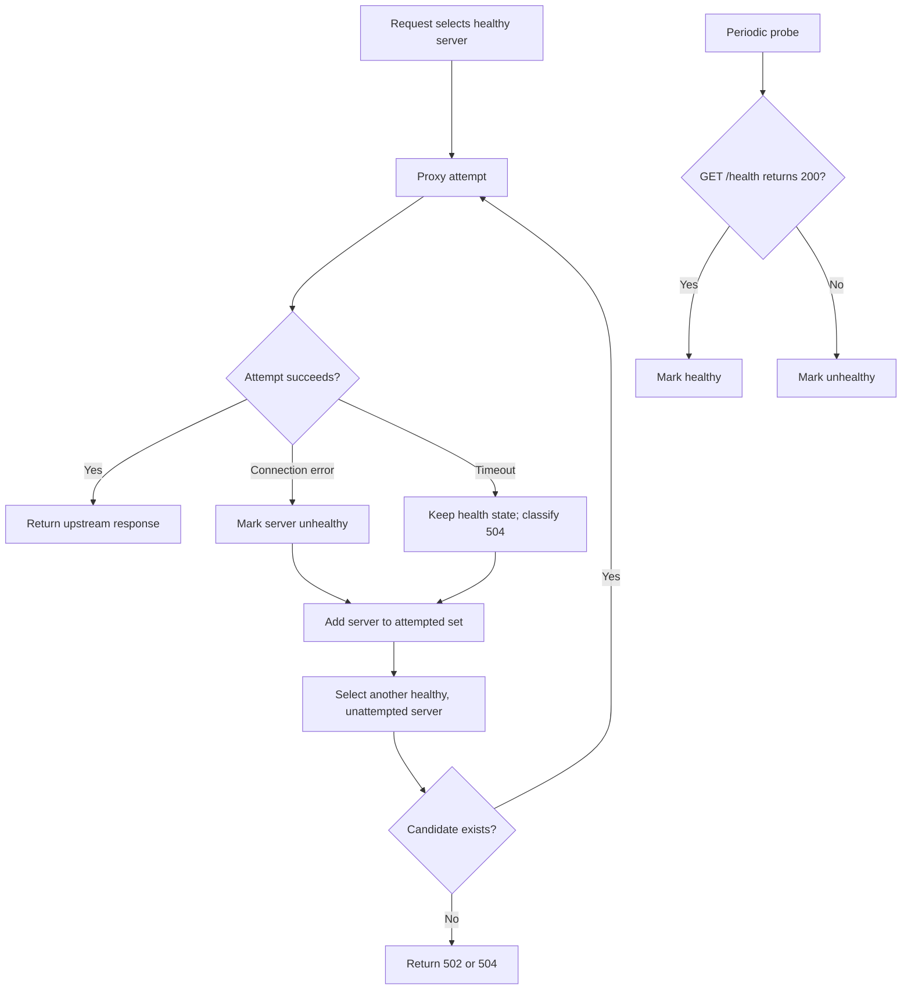

# Health Checks and Failover

## Purpose

Health checks maintain the eligibility state used by the load-balancing strategies. Failover handles a request-time upstream failure by excluding the failed instance and attempting another eligible instance.

These mechanisms complement one another: periodic probing discovers recovery or persistent unavailability, while proxy errors react during real traffic.

## Periodic health checks

`HealthChecker` receives the process-wide `ServerPool`. Its `start()` method schedules `checkAll()` with `setInterval` using `HEALTH_INTERVAL`. For every upstream server, it sends a `GET /health` request to the configured host and port with `HEALTH_TIMEOUT`.

| Probe outcome | State change |
|---|---|
| HTTP `200` | `server.markHealthy()` |
| Other response status | `server.markUnhealthy()` |
| Request timeout | Destroy request and mark unhealthy |
| Request error | Mark unhealthy |

The demo backend returns a `200` JSON response for all request paths, including `/health`. It does not implement a specialized health response.

## Failover flow

If no healthy upstream exists before any attempt, the proxy returns `503 Service Unavailable` with a message indicating that no healthy server is available. If at least one attempt was made and every candidate fails, the final status reflects the last error: `504 Gateway Timeout` for a timeout or `502 Bad Gateway` otherwise.

## Important classes

| Component | Role |
|---|---|
| `HealthChecker` | Schedules and performs probes. |
| `UpstreamServer` | Holds `healthy` and active connection state. |
| `ServerPool` | Provides all servers for probing and service-specific servers for selection. |
| `LoadBalancer` | Passes health-aware candidate lists to strategy objects. |
| `forwardRequest()` | Performs request-time retry and error translation. |

## Design decisions

- **Health belongs to the server model:** each strategy can use the same eligibility criterion.
- **All instances are probed:** recovery is detected without waiting for a client request.
- **Retry exclusions are request-local:** a failed server is not retried within the same forwarded request.

## Current limitations

- Probes begin only after the first interval; instances are initially considered healthy.
- Health checking uses no threshold, backoff, jitter, or circuit-breaker state.
- `setInterval` is not retained for shutdown or cancellation.
- Only status `200` is considered healthy.
- Timeout failures are retried but do not directly mark a server unhealthy.
- There is no readiness/liveness distinction or configurable probe path.

For manual container scenarios, see the preserved [`testing/failover.md`](testing/failover.md). The failover benchmark report is [`../benchmarks/04-failover.md`](../benchmarks/04-failover.md).
