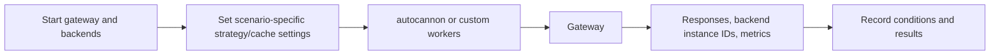

# Benchmarks

## Purpose

The benchmark directory contains load-generation tooling and recorded observations for baseline proxying, caching, load-balancer distribution, and failover. These documents capture specific test environments; they are not a performance guarantee for another machine, configuration, or workload.

## Running the supplied load tests

The package scripts use `autocannon` with 50 concurrent connections, a 20-second duration, and a `Bearer user-token` header:

```bash
npm run benchmark:users
npm run benchmark:products
npm run benchmark:payments
```

The custom distribution script sends 1,000 requests to `/users` using 50 concurrent workers and counts the backend instance in each response:

```bash
node benchmarks/loadBalancerBenchmark.js
```

Start the Docker deployment first and ensure the rate limit and active cache configuration will not distort the scenario under test.

## Existing reports

| File | Focus |
|---|---|
| [`../benchmarks/01-baseline.md`](../benchmarks/01-baseline.md) | Baseline gateway load test. |
| [`../benchmarks/02-cache.md`](../benchmarks/02-cache.md) | Cold and warm cache behavior. |
| [`../benchmarks/03-load-balancer.md`](../benchmarks/03-load-balancer.md) | Distribution under all three strategies. |
| [`../benchmarks/04-failover.md`](../benchmarks/04-failover.md) | Traffic continuity after stopping and restarting an instance. |

The reports are preserved as recorded artifacts and are not rewritten by this documentation.

## Measurement flow



For distribution tests, caching must be disabled for the route being measured. A cache hit stops at the gateway and never exercises the load balancer, so it would make backend instance counts misleading. For cache tests, clear the cache before a cold-cache run with authenticated `DELETE /admin/cache`.

## Interpreting results

- **Baseline:** measures the combined cost of gateway middleware, routing, selection, proxying, and the demo backend under the stated setup.
- **Cache:** compare behavior only when the same route cache policy, TTL, and request pattern are in effect. Concurrent cold requests can produce several misses before the first stored entry is visible.
- **Load balancing:** round robin is deterministic over healthy instances; random and least connections need a sufficiently large sample and should be read as distributions, not exact sequences.
- **Failover:** verify both that a failed instance is excluded and that a recovered instance re-enters service after a successful health check.

## Configuration caveat

The current `gateway.yaml` disables cache for `users` and sets its strategy to `leastConnections`. Some recorded reports intentionally describe a temporary users cache setting or a round-robin selection to isolate a feature. Keep the report's stated configuration with its result, and treat the checked-in YAML as the default runtime configuration.

## Current limitations

- Benchmark scripts target a fixed `http://localhost:8080` URL.
- Results depend on Docker, host hardware, local networking, backend behavior, and rate-limit settings.
- There is no automated benchmark setup, results export, regression threshold, or CI performance gate.
- The custom load-balancer script does not verify response status before parsing its body and counts only responses that successfully parse.
- The stored reports are historical snapshots, not automatically regenerated measurements.

See [load balancing](03-load-balancer.md), [cache](04-cache.md), and [health checks](07-health-checks.md) for the mechanisms exercised by these scenarios.
