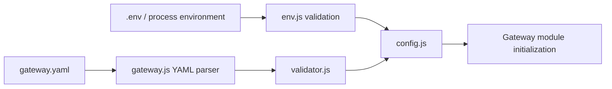

# Configuration and Validation

## Purpose

Gateway behavior is assembled from environment settings and `src/config/gateway.yaml`. This separation keeps deployment-specific values such as timeouts and ports outside the service topology, while YAML defines routes, service policy, and upstream instances.

## Loading sequence

`env.js` calls `dotenv.config()` and constructs a configuration object from required process variables. `gateway.js` reads and parses `gateway.yaml` synchronously at module load, then calls `validateGatewayConfig()`. `config.js` merges both objects and freezes only the top-level result.



An invalid or missing required value fails startup. There is no fallback default in the environment loader.

## Environment settings

| Variable | Used by | Constraint |
|---|---|---|
| `PORT` | Gateway listener | Numeric, 1–65535 |
| `UPSTREAM_TIMEOUT` | Proxy request timeout | Numeric, at least 1 |
| `HEALTH_INTERVAL` | Health-check schedule | Numeric, at least 1000 ms |
| `HEALTH_TIMEOUT` | Individual health probe | Numeric, at least 500 ms |
| `RATE_LIMIT` | Fixed-window limiter | Numeric, at least 1 |
| `RATE_WINDOW_MS` | Fixed-window limiter | Numeric, at least 1 ms |

The local `.env` file is excluded from Git. No `.env.example` is provided, so a new environment must supply all six values before the server can import its configuration.

## YAML shape

```yaml
routes:
  - path: /users
    service: users

services:
  users:
    strategy: leastConnections
    cache:
      enabled: false
      ttl: 10
    instances:
      - host: users1
        port: 8001
```

`routes` is an ordered array. `services` is a map keyed by service name. Every instance becomes an upstream server belonging to that service, while `strategy` selects the service's load-balancer implementation. Cache TTL values are in seconds and are used only when `enabled` is true.

## Validation behavior

The validator checks the following at startup:

| Area | Checks |
|---|---|
| Routes | `routes` is an array; each entry has `path` and `service`; service reference exists. |
| Duplicate routes | Exact duplicate path strings are rejected. |
| Services | The `services` object exists. |
| Strategy | Must be `roundRobin`, `random`, or `leastConnections`. |
| Cache | Object exists; `enabled` is boolean; `ttl` is a positive number. |
| Instances | Array is non-empty; each instance has truthy `host` and `port`; duplicate host/port pairs are rejected within a service. |

Validation does not resolve DNS names, open upstream connections, validate port ranges or types beyond truthiness, detect overlapping route prefixes, or validate unknown top-level YAML fields.

## Runtime views

Administrator endpoints expose selected configuration and derived runtime state:

- `GET /admin/config` returns server, proxy, health, and rate-limit settings, but not routes or service definitions.
- `GET /admin/routes` returns the router's active path/service snapshot.
- `GET /admin/services` combines each configured strategy with its server-pool snapshot.

These endpoints are read-only except cache administration; they do not reload or change configuration.

## Design decisions and limitations

- The synchronous read is acceptable for startup-only configuration and ensures the application starts with a validated complete view.
- Routes and service policy are checked together, preventing unresolved route targets.
- Configuration modules are imported by process-wide singletons, so test or runtime changes after import do not reconfigure the running gateway.
- `Object.freeze(config)` is shallow: nested settings are not deeply frozen.

See [routing](02-routing.md), [load balancing](03-load-balancer.md), and [deployment](13-deployment.md) for how configuration values are consumed.
