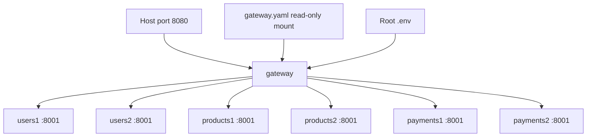

# Deployment

## Purpose

Docker assets provide a repeatable local topology with one gateway and six demo backend instances. They demonstrate hostname-based upstream configuration and allow routing, balancing, health, cache, and failover behavior to run together.

## Container images

Both Dockerfiles use `node:22-alpine`, set `/app` as the working directory, install dependencies with `npm ci`, copy the project, create a non-root user, and start a Node entry point.

| Image | Entrypoint | Exposed port | Runtime user |
|---|---|---|---|
| Gateway | `src/server/server.js` | 8080 | `gateway` |
| Backend | `src/backend/server.js` | 8001 | `backend` |

The backend image is shared by all six backend services. Its behavior is configured by `SERVICE_NAME`, `INSTANCE_ID`, and `PORT` environment variables.

## Compose topology



The configured hostnames in `gateway.yaml` match the Compose service/container names. Compose exposes only the gateway's port `8080` to the host; backend port `8001` remains available on the Compose network.

## Running the stack

From the repository root:

```bash
docker compose -f docker/docker-compose.yml up --build
```

The Compose file lives in `docker/`, so specifying it is required when running from the repository root. It mounts `src/config/gateway.yaml` into the gateway container as read-only and loads gateway environment variables from `../.env` relative to the Compose file.

`depends_on` starts backend containers before the gateway container, but it does not wait for their health readiness. The gateway initially considers upstreams healthy and the periodic health checker updates their state over time.

## Deployment considerations

- The `.dockerignore` excludes `node_modules` and `.git` from the build context; each image installs dependencies inside the container.
- The `.gitignore` excludes `.env`, so deployment secrets/configuration are not committed by default.
- The mounted YAML makes topology changes visible to the container filesystem, but the running application does not reload configuration after startup.
- The gateway container runs as a non-root user, which is a useful baseline hardening measure.

## Current limitations

- Compose is local orchestration, not production scheduling or horizontal scaling.
- There are no Docker healthchecks, restart policies, resource limits, secrets integration, TLS termination, or ingress configuration.
- Backend images contain the complete project source because they share the repository build context.
- `container_name` values make the example easy to inspect but reduce flexibility for scaling duplicate services.
- A host `.env` file is required and no committed sample is supplied.

For manual failure exercises, see [health checks and failover](07-health-checks.md) and [`testing/failover.md`](testing/failover.md).
